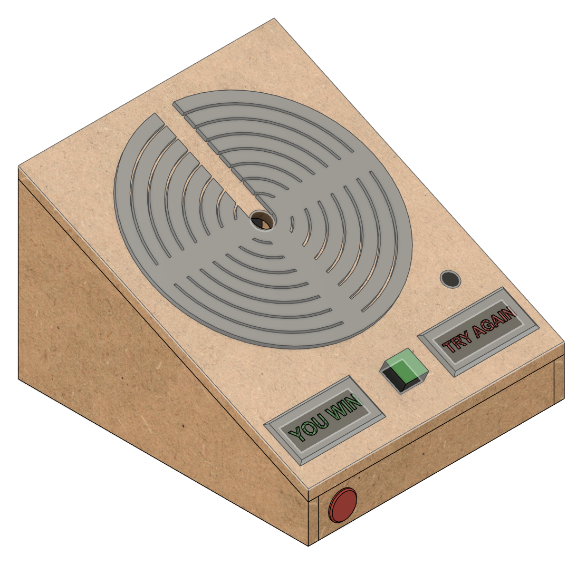
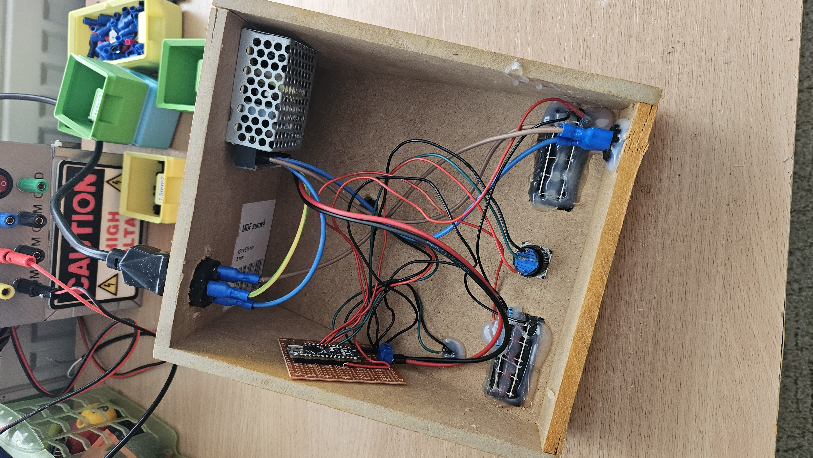
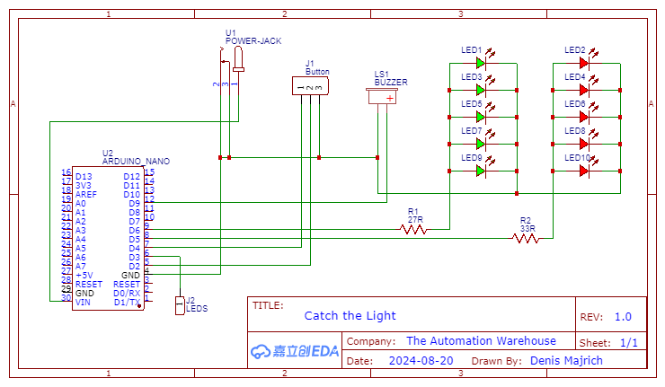

# Catch-The-Light

Made as part of Arcade Hack Club

Used github copilot when writing code and readme.

////// Video of the game in action//////

Inspired by the arcade game [Speed Demon](https://www.arcade-museum.com/Arcade/speed-demon) I wanted to make crude version of it using a circular LED matrix I found ounline.

## Hardware

I made a base out of 8mm MDF and used a 3D printed spacer to hold the LED rings.
This was not a very good design as MDF had a tendency to split and my paint job was not the best.

The stop button is a random button I found in my parts bin.
I also made two custom backlit signs for the game: green "YOU WIN" and red "TRY AGAIN".

The signs were printed in multiple parts and glued together (there is no need for a multi material printer).

A piezo buzzer is used for sound effects throughout the game.

The whole build is powered by a 5V 3A meanwell power supply with a switch mounted in the front and a C13 power socket in the back.

The brains of the operation is an arduino nano clone on piece of perfboard.

## Shematic

## Code

The game starts with the player selecting of 3 difficulty levels, which changes how many LEDs are lit as the target (5, 4 or 3).
A light will start moving around the ring and the player has to press the button when the light is on any of the target LEDs.
If the player fails an animation will play and the game will restart.
If the player succeeds, the light will be able to move to the next ring and the target will change.
If the player reaches the last ring, an animation will play and the game will restart.

